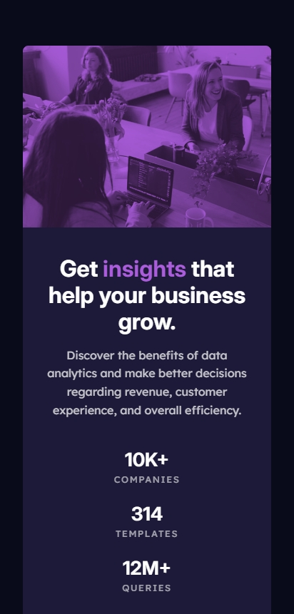
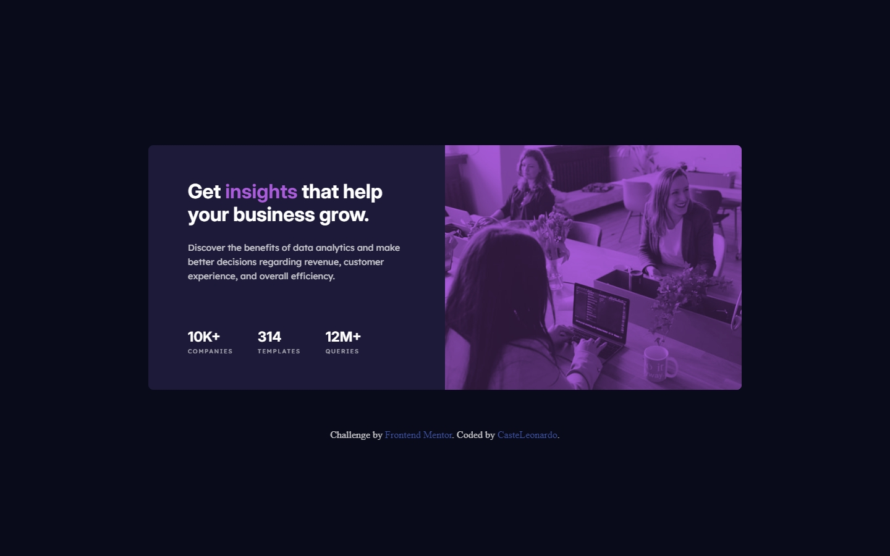

# Frontend Mentor - Stats preview card component solution

This is a solution to the [Stats preview card component challenge on Frontend Mentor](https://www.frontendmentor.io/challenges/stats-preview-card-component-8JqbgoU62). Frontend Mentor challenges help you improve your coding skills by building realistic projects. 


## Table of contents

- [Overview](#overview)
  - [The challenge](#the-challenge)
  - [Screenshot](#screenshot)
  - [Links](#links)
- [My process](#my-process)
  - [Built with](#built-with)
  - [What I learned](#what-i-learned)
  - [Continued development](#continued-development)
  - [Useful resources](#useful-resources)
  - [AI Collaboration](#ai-collaboration)
- [Author](#author)
- [Acknowledgments](#acknowledgments)


## Overview

### The challenge

Users should be able to:

- View the optimal layout depending on their device's screen size


### Screenshot

Mobile Design





Desktop Design





### Links

- Solution URL: [solution URL here](https://github.com/CasteLeonardo/stats-preview-card-component-main)
- Live Site URL: [live site URL here](https://llano-stats-preview-card-component.netlify.app/)


## My process

### Built with

- Semantic HTML5 markup
- CSS custom properties
- Flexbox
- CSS Grid
- Mobile-first workflow
- BEM naming convention
- <picture> element for responsive images


### What I learned

This project gave me more practice creating responsive layouts and adapting a component from a stacked mobile layout to a two-column desktop layout using CSS Grid.

One of the main concepts I learned during this project was the mix-blend-mode property. I used mix-blend-mode: multiply together with a colored background and image opacity to recreate the purple color overlay from the original design.

For example:

```css
.stats-card__image {
    background-color: var(--Purple500);
}

.stats-card__image img {
    mix-blend-mode: multiply;
    opacity: 0.75;
}
```

This helped me understand how blend modes can be used to combine an image with its background and achieve visual effects without needing to edit the original image.

I also practiced using the <picture> element to display different images depending on the screen size:

```css
<picture class="stats-card__image">
    <source
        media="(min-width: 768px)"
        srcset="./images/image-header-desktop.jpg"
    >

    
</picture>
```

I also continued practicing semantic HTML by using a description list (<dl>) for the statistics section, as well as using CSS Grid to reorganize the card layout on larger screens.

### Continued development

I want to continue improving my CSS skills, especially with:

- Creating more accurate responsive layouts
- Improving my understanding of Flexbox and CSS Grid
- Exploring more CSS properties and visual effects
- Writing cleaner and more maintainable CSS
- Improving spacing, sizing, and typography to match designs more accurately
- Practicing semantic HTML and accessible markup
- Becoming more comfortable with the BEM naming convention

### Useful resources

- [Frontend Mentor](https://www.frontendmentor.io/home) - The challenge and design reference used for this project.
- [MDN Web Docs](https://developer.mozilla.org/en-US/) - Useful documentation for HTML and CSS concepts.
- [CSS-Tricks](https://css-tricks.com/) - Useful articles and guides about CSS layouts and responsive design.


### AI Collaboration

I used ChatGPT as a development assistant throughout the project.

I mainly used it to:

- Discuss possible approaches to CSS styling and hover interactions.
- Get feedback on naming conventions and code organization.
- Improve the project documentation and README.
- Discuss Git commit organization and commit messages.

The implementation and final decisions were made by me. AI was used as a tool for guidance, feedback, and brainstorming rather than as a replacement for writing and understanding the code.


## Author

- Website - [Leonardo Castellanos Portafolio](https://llanoportafolio.netlify.app/)
- Frontend Mentor - [@CasteLeonardo](https://www.frontendmentor.io/profile/CasteLeonardo)
- GitHub - [@CasteLeonardo](https://github.com/CasteLeonardo)
- Linkedin - [Leonardo Castellanos Rivera](https://www.linkedin.com/in/leonardo-castellanos-rivera/)


## Acknowledgments

Thanks to Frontend Mentor for providing the challenge and design reference used to build this project.

This project was completed independently as part of my continued practice with front-end development.
